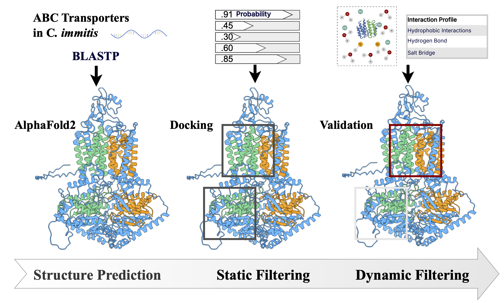

# ABC Transporter Resistance Pipeline for Valley fever

This repository implements a **computational pipeline** integrating protein structure modeling, ligand docking, interaction profiling, and scoring to prioritize 
druggable binding pockets that may mediate antifungal resistance.

---



[](https://aiscihub.github.io/valleyfeverresearch/)

## Pipeline Overview

```text
1. Domain Confidence Scoring    → Alphafold + InterPro + pLDDT
2. Docking Configuration        → PrankWeb + Vina grid setup
3. Docking Simulation           → AutoDock Vina (GPU or CPU)
4. Ligand–Pocket Interaction    → PLIP for interaction profiling
5. Composite Scoring            → pocket probability + PLIP
6. Dynamic Stability Evaluation → OpenMM Molecular Dynamics
```

---

## Folder Structure
```
valleyfever/
├── dataset/
│   └── protein_db/
│       ├── docking/             # docking inputs/outputs
│       ├── md/                  # molecular dynamics outputs
│       └── results/             # scoring, summaries, tables
├── pipeline/                    # main computational pipeline
│   ├── domain_analysis/         # domain-level pLDDT scoring
│   ├── docking/                 # grid setup and postprocessing
│   ├── scoring/                 # composite scoring logic
│   ├── md/                      # OpenMM-based MD engine
│   └── plip/                    # ligand interaction profiling
├── run_all_docking_dynamic.sh  # script to launch docking
└── README.md
```

---

## Script Mapping to Paper Sections
| **Pipeline Step**              | **Script**                                           |
|-------------------------------|------------------------------------------------------|
| Domain confidence scoring     | `alphafold_domain_results_cur.py`                   |
| Docking setup                 | `gen_docking_config.py`, `run_all_docking_dynamic.sh` |
| Docking result processing     | `docking_result_process.py`                         |
| Composite scoring & ranking   | `composite_score.py`                                |
| Ligand–pocket interaction     | `run_plip_analyze_individual.py`                    |
| Molecular dynamics simulation | `run_openmm_md.py`                                  |

---

## Quick Start

### Docking Preparation
```bash
python pipeline/docking/gen_docking_config.py
bash run_all_docking_dynamic.sh
```

### Process Docking Results
```bash
python pipeline/docking/docking_result_process.py
```

### Run Composite Scoring
```bash
python pipeline/scoring/composite_score.py
```

###  Run Molecular Dynamics
```bash
python pipeline/md/run_openmm_md.py \
  --base_dir /path/to/complex \
  --sdf_filename ligand.sdf \
  --pdb_filename complex.pdb \
  --n_steps 50000
```

---


---

##  Environment Setup
```bash
conda create -n abc_pipeline python=3.10
conda activate abc_pipeline
pip install -r requirements.txt
```

